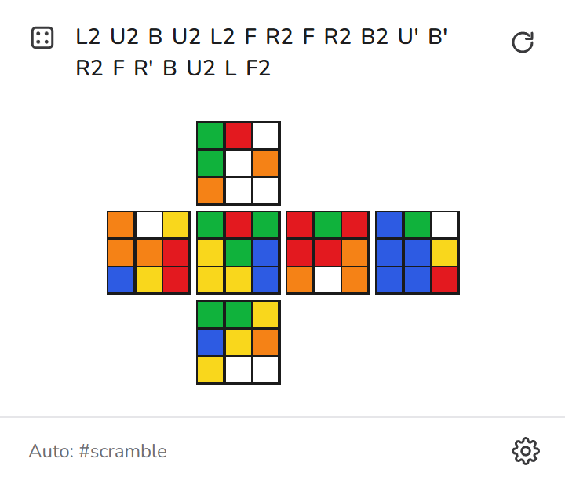
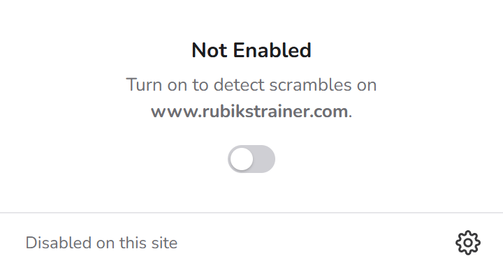
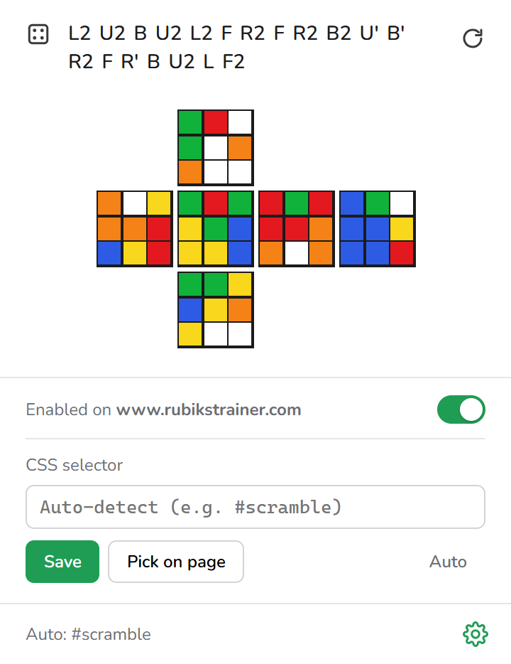

# Scramble Preview

Browser extension (Chrome / Edge, Manifest V3) that reads a 3x3 scramble from the current page and shows the scrambled cube as an unfolded net (U on top, L F R B across, D below; white top, green front). Use it to check that you scrambled your cube correctly before you start solving.

For example, you can use it on [rubikstrainer.com/cross2f2l](https://www.rubikstrainer.com/cross2f2l). The scramble there is picked up automatically, with no selector needed.

To see what it does, open [landing/index.html](landing/index.html) in a browser. It has a demo of the popup and a scramble playground.

  

| Not enabled | Settings |
| :---: | :---: |
|  |  |

## Install

1. Open `chrome://extensions` (or `edge://extensions`) and turn on **Developer mode**.
2. Click **Load unpacked** and select this folder.
3. Pin the extension to the toolbar if you like.

## Use

Works on sites such as [rubikstrainer.com/cross2f2l](https://www.rubikstrainer.com/cross2f2l) and other timers or trainers that show the scramble as text.

- Every site is **off by default**. Open the popup and turn on the toggle under "Not Enabled" to enable it for the current site (saved per hostname). To turn it off again, use the toggle at the top of the ⚙ settings panel.
- Once enabled, the scramble is detected automatically and the cube preview is shown. While the popup is open it re-checks the page every 1.5 s, so a new scramble shows up on its own.
- Click the scramble text to edit it by hand. Click ↻ to read it from the page again.
- Click ⚙ to set a **CSS selector** for the current site (for example `#scramble`). You can also click **Pick on page** and then click the scramble text on the page. Click **Auto** to go back to auto-detection.

Supported notation: `R U F L D B` with `'`, `2` and `3`, wide moves (`Rw`, `r`), slice moves (`M E S`) and rotations (`x y z`).

Auto-detection first looks at visible elements whose id or class contains "scramble". If none match, it uses the longest line of page text that is mostly moves.
